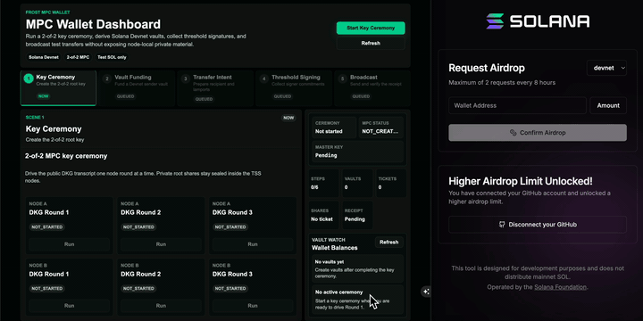

# FROST Template

Minimal 2-of-2 FROST Ed25519 Solana Devnet wallet demo with step-by-step DKG, wallet derivation, signing, broadcast, and confirmation.



## Table of Contents

- [Specifications](#specifications)
- [Tech Stack](#tech-stack)
- [System Design](#system-design)
- [Folder Structure](#folder-structure)
- [Getting Started](#getting-started)
- [Manual Acceptance Checklist](#manual-acceptance-checklist)
- [OpenAPI Spec](#openapi-spec)
- [API Reference](#api-reference)
- [AI Collaboration Evidence](#ai-collaboration-evidence)
- [CI And Versioning](#ci-and-versioning)
- [Troubleshooting](#troubleshooting)
- [Out Of Scope](#out-of-scope)

## Specifications

### Functional Requirements

| Area | Requirement |
|---|---|
| DKG | The frontend lets the reviewer independently trigger Node A and Node B for DKG rounds 1, 2, and 3. |
| DKG result | A completed DKG session shows a Base58 master public key and persists across service restarts. |
| Wallet derivation | The coordinator derives sequential public wallet addresses from public DKG context without asking TSS nodes to communicate. |
| Balance lookup | Each derived wallet can refresh its Solana Devnet balance. |
| Signing request | The reviewer can select a sender wallet, enter a recipient address and lamports amount, and create a trackable signing request. |
| Signing rounds | Node A and Node B signing rounds are independently triggerable and visible in the UI. |
| Broadcast | After both signature shares exist, the coordinator aggregates the FROST signature and broadcasts a Solana transfer. |
| Confirmation | The reviewer can refresh confirmation and inspect a Solana Explorer link. |
| Persistence | DKG state, derived wallets, and signing request history are stored in PostgreSQL. |

### Non-Functional Requirements

| Area | Requirement |
|---|---|
| Runtime | `docker compose up -d` starts PostgreSQL, Coordinator, Node A, Node B, and Frontend. |
| Devnet default | `SOLANA_RPC_URL` defaults to `https://api.devnet.solana.com`. |
| Private material boundary | Root shares, child signing shares, and nonce secrets stay inside TSS node schemas. |
| Reviewer visibility | README, AI logs, decision logs, contracts, and verification scripts explain the implementation journey. |
| Testing | CI and local verification run backend tests, frontend lint/build, and integration smoke checks. |

### Out-Of-Scope Table

| Item | Reason |
|---|---|
| Mainnet SOL | This is a Devnet assignment demo. Devnet SOL is test money only. |
| Production MPC deployment | The assignment evaluates observable FROST/TSS behavior, not a hardened production service. |
| One-click "Run All" protocol buttons | The assignment explicitly requires step-by-step DKG and signing controls. |
| Integrated faucet | Reviewers manually fund derived Devnet wallets through a faucet or Solana CLI. |
| Compatibility with mainstream Solana derivation paths | The assignment allows non-hardened Edwards derivation without wallet compatibility requirements. |

## Tech Stack

| Layer | Technology | Notes |
|---|---|---|
| Frontend | Next.js 16, React 19, TypeScript 5.9 | Browser calls Coordinator only. |
| Coordinator | Rust 1.94, axum 0.8.8, sqlx 0.8.6 | Orchestrates protocol state, derives public wallets, aggregates signatures, broadcasts transactions. |
| TSS Nodes | Rust 1.94, `frost-ed25519`, `hd-wallet` | Own encrypted private DKG and signing state. |
| Database | PostgreSQL 18 | One instance with coordinator, node A, and node B schemas. |
| Solana | Devnet RPC, `solana-sdk` 3.0.0, `solana-client` 3.1.8 | Default RPC is `https://api.devnet.solana.com`. |
| Tooling | Docker Compose, mise, npm, Cargo | Docker Compose is the primary reviewer path. |

## System Design

### Architecture

```text
Browser / Reviewer
        |
        v
Frontend :3000
        |
        v
Coordinator :8080 ---------------> Solana Devnet RPC
        |
        +------------------------+
        |                        |
        v                        v
TSS Node A :8081          TSS Node B :8081
        |                        |
        +-----------+------------+
                    v
             PostgreSQL :5432

Schemas:
- coordinator: public protocol state, wallets, signing requests
- node_a: encrypted private node A DKG/signing state
- node_b: encrypted private node B DKG/signing state
```

### Data Flow: DKG

```text
1. Reviewer clicks Create Session.
2. Reviewer triggers Node A/B DKG Round 1.
3. Coordinator stores public Round 1 payloads.
4. Reviewer triggers Node A/B DKG Round 2.
5. Coordinator routes peer packages and stores public payloads.
6. Reviewer triggers Node A/B DKG Round 3.
7. Nodes persist encrypted key packages; Coordinator stores the master public key only.
```

### Data Flow: Wallet Derivation

```text
1. Reviewer clicks Create Wallet.
2. Coordinator reads completed DKG public context.
3. Coordinator derives the next public wallet address with non-hardened Edwards derivation.
4. Coordinator stores wallet index, derivation path, public key, address, and balance cache.
5. Reviewer can refresh the Devnet balance for that address.
```

### Data Flow: Signing And Broadcast

```text
1. Reviewer creates a signing request from a sender wallet to a recipient wallet.
2. Reviewer triggers Node A/B Signing Round 1 to produce public commitments.
3. Coordinator fetches a recent blockhash and builds the exact Solana transfer message.
4. Reviewer triggers Node A/B Signing Round 2.
5. Each node validates the message intent, derives the child signing share in memory, consumes its nonce once, and returns a signature share.
6. Reviewer clicks Aggregate & Broadcast.
7. Coordinator aggregates signature shares, builds the Solana transaction, broadcasts it, stores the transaction signature, exposes an Explorer URL, and the frontend refreshes Vault Watch balances.
8. Reviewer clicks Refresh Confirmation until the request is CONFIRMED or FAILED; the frontend refreshes Vault Watch balances again after confirmation updates.
```

### DB Schema Summary

```text
coordinator.dkg_sessions
  id, status, master_public_key_base58, public_derivation_context, timestamps

coordinator.dkg_node_steps
  session_id, node_id, round, status, public_payload, error_message, timestamps

coordinator.wallets
  wallet_index, dkg_session_id, derivation_path, public_key_base58, address_base58,
  balance_lamports, balance_status, balance_error_message, timestamps

coordinator.signing_requests
  id, wallet_index, sender_address_base58, recipient_address_base58, amount_lamports,
  status, message_payload, message_hash_hex, recent_blockhash,
  transaction_signature, explorer_url, error_message, timestamps

coordinator.signing_node_steps
  request_id, node_id, round, status, public_payload, error_message, timestamps

node_a.node_dkg_state / node_b.node_dkg_state
  encrypted DKG secret packages and final key package

node_a.node_signing_states / node_b.node_signing_states
  encrypted signing nonces, signature share metadata, nonce consumption timestamp
```

## Folder Structure

```text
frost-template/
├── ASSIGNMENT_en.md                         # Original assignment in English
├── ASSIGNMENT_zh.md                         # Original assignment in Chinese
├── CHANGELOG.md                             # Versioned release notes
├── VERSION                                  # Current numeric version
├── docker-compose.yml                       # Full local stack
├── features/                                # BDD scenarios by phase
│   ├── dkg-flow.feature
│   ├── project-foundation.feature
│   ├── reviewer-experience.feature
│   ├── signing-transfer.feature
│   └── wallet-derivation.feature
├── backend/
│   ├── Cargo.toml                           # Rust workspace
│   ├── migrations/                          # PostgreSQL schemas and tables
│   ├── coordinator/                         # Coordinator API and orchestration
│   └── tss-node/                            # TSS node runtime and crypto operations
├── frontend/
│   ├── app/                                 # Next.js app router UI and API proxy
│   └── package.json
├── docs/
│   ├── contracts/                           # API/state contracts
│   ├── release-process.md
│   └── ai-native/                           # Prompts, logs, decisions, verification harness docs
└── scripts/
    ├── extract-release-notes.mjs
    ├── verify-phase.sh
    └── verify-release-metadata.mjs
```

## Getting Started

### 1. Prerequisites

Install Docker Desktop or another Docker Compose compatible runtime.

Optional native tooling:

```bash
curl https://mise.run | sh
brew install mise
mise install
node --version
rustc --version
```

Expected native versions:

```text
Node.js v24.14.0
Rust rustc 1.94.0
```

### 2. Configure Environment

The default Docker Compose stack works without a `.env` file. To override values, copy the example:

```bash
cp .env.example .env
```

Useful optional overrides:

```bash
SOLANA_RPC_URL=https://api.devnet.solana.com
POSTGRES_HOST_PORT=5432
COORDINATOR_HOST_PORT=8080
FRONTEND_HOST_PORT=3000
```

Do not commit `.env`.

### 3. Start The Full Docker Stack

```bash
docker compose up -d
```

Verify services:

```bash
docker compose ps
curl -s http://localhost:8080/health
curl -s http://localhost:8080/health/nodes
curl -s http://localhost:8081/health
curl -s http://localhost:8082/health
```

Open the frontend:

```bash
open http://localhost:3000
```

If `open` is not available, visit [http://localhost:3000](http://localhost:3000).

### 4. Run Local Verification

```bash
node scripts/verify-release-metadata.mjs
./scripts/verify-phase.sh 8
```

`./scripts/verify-phase.sh 8` runs the latest reviewer-ready harness. It includes the mock Solana integration from Phase 6, uses an isolated Docker Compose project with `SOLANA_RPC_URL=mock://phase6`, ports `13000`, `18080`, and `15432`, then removes that mock stack. It does not overwrite the normal Devnet demo stack.

Earlier phase-specific checks such as `./scripts/verify-phase.sh 7` remain available, but Phase 8 is the merge gate for this branch.

If you want to force the local demo coordinator back to Devnet:

```bash
docker compose up -d --force-recreate coordinator
```

### 5. Stop The Stack

```bash
docker compose down
```

To remove local database and dependency volumes:

```bash
docker compose down -v
```

## Manual Acceptance Checklist

### A. Complete DKG

1. Open `http://localhost:3000`.
2. Click `Create Session`.
3. Run `Node A` Round 1.
4. Run `Node B` Round 1.
5. Run `Node A` Round 2.
6. Run `Node B` Round 2.
7. Run `Node A` Round 3.
8. Run `Node B` Round 3.
9. Confirm the session status is `COMPLETED`.
10. Confirm the Master Key field shows a Base58 public key.

### B. Create And Fund Wallets

1. In `Wallet Derivation`, set `Index` to `0`.
2. Click `Create Wallet`.
3. Copy the displayed Wallet 0 address.
4. Fund Wallet 0 with Devnet SOL through [https://faucet.solana.com/](https://faucet.solana.com/) or the Solana CLI:

```bash
solana airdrop 0.5 <WALLET_0_ADDRESS> --url devnet
```

5. Click `Balance` for Wallet 0.
6. Confirm the status is `AVAILABLE` and the balance is greater than `0`.
7. Create Wallet 1 and copy its address for the recipient.

Wallet addresses are visible in the `Wallet Derivation` section. These are the addresses reviewers can fund manually.

### C. Send A Devnet Transfer

Recommended demo amounts:

```text
10000000 lamports = 0.01 SOL
1000000 lamports = 0.001 SOL
```

Use a larger amount when sending to a brand-new recipient address because Solana may require enough lamports for rent-exempt account creation.

1. In `Signing Requests`, select `Wallet 0` as sender.
2. Paste Wallet 1, or another normal Devnet wallet address, as recipient.
3. Enter `10000000` lamports for a visible transfer.
4. Click `Create Request`.
5. Select the new request.
6. Run `Node A` Signing Round 1.
7. Run `Node B` Signing Round 1.
8. Run `Node A` Signing Round 2.
9. Run `Node B` Signing Round 2.
10. Confirm the request status is `READY_TO_AGGREGATE`.
11. Click `Aggregate & Broadcast`.
12. Confirm the request status becomes `BROADCASTED` and Vault Watch refreshes the sender balance.
13. Click `Refresh Confirmation`.
14. Confirm the request status becomes `CONFIRMED` and Vault Watch refreshes balances again.
15. Click `Open Explorer` and confirm the Devnet transaction is successful.

### D. Inspect Persistence

```bash
docker compose restart coordinator node-a node-b frontend
```

Refresh the frontend and confirm completed DKG, derived wallets, and signing request history are still visible.

### E. Inspect Private Material Boundary

Coordinator responses should not contain private field names:

```bash
curl -s http://localhost:8080/api/dkg/sessions/active
curl -s http://localhost:8080/api/wallets
curl -s http://localhost:8080/api/signing-requests
```

The coordinator stores public protocol state only. Encrypted node-local material lives under `node_a` and `node_b` database schemas.

## OpenAPI Spec

The public Coordinator API is also documented as OpenAPI 3.1 in [docs/openapi.yaml](docs/openapi.yaml).

Reviewers can import this file into Swagger Editor, Postman, or Insomnia. The repo also includes a local Swagger UI viewer at [docs/swagger-ui.html](docs/swagger-ui.html).

To view the API documentation as a local website, run this from the repository root:

```bash
python3 -m http.server 18081
open http://localhost:18081/docs/swagger-ui.html
```

The raw OpenAPI file is available at `http://localhost:18081/docs/openapi.yaml` while the static server is running. The default API server is `http://localhost:8080`, which matches the Docker Compose Coordinator service.

## API Reference

All API examples target the Coordinator at `http://localhost:8080`.

### Health

```bash
curl -s http://localhost:8080/health
```

Response:

```json
{
  "service": "coordinator",
  "status": "ok",
  "database_configured": true,
  "solana_rpc_configured": true,
  "node_a_url": "http://node-a:8081",
  "node_b_url": "http://node-b:8081"
}
```

### Node Health

```bash
curl -s http://localhost:8080/health/nodes
```

Response:

```json
{
  "nodes": [
    { "node_id": "node-a", "url": "http://node-a:8081", "reachable": true },
    { "node_id": "node-b", "url": "http://node-b:8081", "reachable": true }
  ]
}
```

### Create DKG Session

```bash
curl -s -X POST http://localhost:8080/api/dkg/sessions \
  -H 'content-type: application/json' \
  -d '{"threshold":2,"participants":["node-a","node-b"]}'
```

Response fields include:

```json
{
  "session_id": "00000000-0000-0000-0000-000000000000",
  "status": "NOT_STARTED",
  "master_public_key_base58": null,
  "node_steps": [
    { "node_id": "node-a", "round": 1, "status": "NOT_STARTED" },
    { "node_id": "node-a", "round": 2, "status": "NOT_STARTED" },
    { "node_id": "node-a", "round": 3, "status": "NOT_STARTED" },
    { "node_id": "node-b", "round": 1, "status": "NOT_STARTED" },
    { "node_id": "node-b", "round": 2, "status": "NOT_STARTED" },
    { "node_id": "node-b", "round": 3, "status": "NOT_STARTED" }
  ]
}
```

### Trigger DKG Round

```bash
curl -s -X POST http://localhost:8080/api/dkg/sessions/<SESSION_ID>/nodes/node-a/rounds/1
```

Error cases:

| Status | Case |
|---|---|
| `400` | Unsupported node or round. |
| `404` | Session not found. |
| `409` | Round prerequisites are not complete. |
| `502` | Node call failed. |

### List Wallets

```bash
curl -s http://localhost:8080/api/wallets
```

Response:

```json
{
  "wallets": [
    {
      "wallet_index": 0,
      "dkg_session_id": "00000000-0000-0000-0000-000000000000",
      "derivation_path": "m/0",
      "public_key_base58": "RRhYs89kY1Fm9NoNk8LXh6X8dC8K7mpQSW3mBxctuqh",
      "address_base58": "RRhYs89kY1Fm9NoNk8LXh6X8dC8K7mpQSW3mBxctuqh",
      "balance_lamports": 500000000,
      "balance_status": "AVAILABLE",
      "balance_error_message": null,
      "balance_checked_at": "2026-06-25 00:00:00+00",
      "created_at": "2026-06-25 00:00:00+00"
    }
  ]
}
```

### Create Wallet

```bash
curl -s -X POST http://localhost:8080/api/wallets
```

Response:

```json
{
  "wallet_index": 0,
  "dkg_session_id": "00000000-0000-0000-0000-000000000000",
  "derivation_path": "m/0",
  "public_key_base58": "RRhYs89kY1Fm9NoNk8LXh6X8dC8K7mpQSW3mBxctuqh",
  "address_base58": "RRhYs89kY1Fm9NoNk8LXh6X8dC8K7mpQSW3mBxctuqh",
  "balance_lamports": null,
  "balance_status": "UNKNOWN",
  "balance_error_message": null,
  "balance_checked_at": null,
  "created_at": "2026-06-25 00:00:00+00"
}
```

Error cases:

| Status | Case |
|---|---|
| `409` | DKG has not completed or wallet derivation is blocked by incomplete state. |

### Refresh Wallet Balance

```bash
curl -s http://localhost:8080/api/wallets/0/balance
```

Response:

```json
{
  "wallet_index": 0,
  "address_base58": "RRhYs89kY1Fm9NoNk8LXh6X8dC8K7mpQSW3mBxctuqh",
  "balance_lamports": 500000000,
  "balance_status": "AVAILABLE",
  "balance_error_message": null
}
```

### Create Signing Request

```bash
curl -s -X POST http://localhost:8080/api/signing-requests \
  -H 'content-type: application/json' \
  -d '{"wallet_index":0,"recipient_address_base58":"6LByMitZ7BejB5QKMuehRjYbrrMEU8RDAisrGV6MAAfE","amount_lamports":10000000}'
```

Response fields include:

```json
{
  "request_id": "00000000-0000-0000-0000-000000000000",
  "dkg_session_id": "00000000-0000-0000-0000-000000000000",
  "wallet_index": 0,
  "sender_address_base58": "RRhYs89kY1Fm9NoNk8LXh6X8dC8K7mpQSW3mBxctuqh",
  "recipient_address_base58": "6LByMitZ7BejB5QKMuehRjYbrrMEU8RDAisrGV6MAAfE",
  "amount_lamports": 10000000,
  "status": "PENDING",
  "message_hash_hex": null,
  "recent_blockhash": null,
  "transaction_signature": null,
  "explorer_url": null,
  "error_message": null,
  "created_at": "2026-06-25 00:00:00+00",
  "updated_at": "2026-06-25 00:00:00+00",
  "node_steps": [
    { "node_id": "node-a", "round": 1, "status": "NOT_STARTED" },
    { "node_id": "node-a", "round": 2, "status": "NOT_STARTED" },
    { "node_id": "node-b", "round": 1, "status": "NOT_STARTED" },
    { "node_id": "node-b", "round": 2, "status": "NOT_STARTED" }
  ]
}
```

Error cases:

| Status | Case |
|---|---|
| `400` | Invalid wallet index, invalid recipient, System Program recipient, or non-positive amount. |
| `404` | Sender wallet not found. |

### Trigger Signing Round

```bash
curl -s -X POST http://localhost:8080/api/signing-requests/<REQUEST_ID>/nodes/node-a/rounds/1
curl -s -X POST http://localhost:8080/api/signing-requests/<REQUEST_ID>/nodes/node-b/rounds/1
curl -s -X POST http://localhost:8080/api/signing-requests/<REQUEST_ID>/nodes/node-a/rounds/2
curl -s -X POST http://localhost:8080/api/signing-requests/<REQUEST_ID>/nodes/node-b/rounds/2
```

Error cases:

| Status | Case |
|---|---|
| `400` | Unsupported node or signing round. |
| `404` | Signing request not found. |
| `409` | Round prerequisites are incomplete, request is failed, or nonce was already consumed. |
| `502` | TSS node call failed. |

### Broadcast Signing Request

```bash
curl -s -X POST http://localhost:8080/api/signing-requests/<REQUEST_ID>/broadcast
```

Response fields include:

```json
{
  "request_id": "00000000-0000-0000-0000-000000000000",
  "status": "BROADCASTED",
  "transaction_signature": "2KPoYwPD9ujhfqDsHRfYEX3owJyxDN5PP93ijW8KLq5K2swRJHwufxg5xtKRzjUoFYkvWGqyM6My2KvMZRDFVSk9",
  "explorer_url": "https://explorer.solana.com/tx/2KPoYwPD9ujhfqDsHRfYEX3owJyxDN5PP93ijW8KLq5K2swRJHwufxg5xtKRzjUoFYkvWGqyM6My2KvMZRDFVSk9?cluster=devnet"
}
```

Error cases:

| Status | Case |
|---|---|
| `409` | Request is not `READY_TO_AGGREGATE` or aggregation validation failed. |
| `502` | Solana RPC rejected the transaction or the send outcome is ambiguous. |

### Refresh Confirmation

```bash
curl -s -X POST http://localhost:8080/api/signing-requests/<REQUEST_ID>/confirm
```

Response fields include:

```json
{
  "request_id": "00000000-0000-0000-0000-000000000000",
  "status": "CONFIRMED",
  "transaction_signature": "2KPoYwPD9ujhfqDsHRfYEX3owJyxDN5PP93ijW8KLq5K2swRJHwufxg5xtKRzjUoFYkvWGqyM6My2KvMZRDFVSk9",
  "error_message": null
}
```

Error cases:

| Status | Case |
|---|---|
| `409` | Request has not been broadcast. |
| `502` | Solana RPC confirmation lookup failed. |

## AI Collaboration Evidence

The assignment explicitly evaluates AI collaboration. The repository keeps the evidence in `docs/ai-native/`.

| File | Purpose |
|---|---|
| `docs/ai-native/00-agent-context.md` | Shared context and non-negotiable boundaries for agents. |
| `docs/ai-native/01-implementation-roadmap.md` | Phase-by-phase implementation plan. |
| `docs/ai-native/prompts/` | Prompts used to drive each phase. |
| `docs/ai-native/logs/ai-collaboration-log.md` | Chronological AI collaboration summary, including corrections. |
| `docs/ai-native/logs/decision-log.md` | Architecture decisions and tradeoffs. |
| `docs/ai-native/logs/phase-*-agent-run-report.md` | Per-phase evidence and verification notes. |
| `docs/ai-native/05-verification-harness.md` | What each phase verification command proves. |

Important human corrections recorded in the project include:

- Preserving history after sensitive local path cleanup instead of rewriting unrelated work.
- Adding CI and version gates once the project reached meaningful integration complexity.
- Moving Phase 6 verification into an isolated mock Docker Compose project so it cannot contaminate the Devnet demo stack.
- Tightening signing safety so TSS nodes validate Solana transfer intent before signing.
- Rejecting the Solana System Program address as a recipient.

## CI And Versioning

Pull requests are expected to pass GitHub Actions before merge:

- Repository hygiene and release metadata.
- Backend Rust tests.
- Frontend lint and build.
- Integration verification.

Release checkpoints use:

```text
VERSION
CHANGELOG.md
frontend/package.json
frontend/package-lock.json
backend/Cargo.toml
backend/Cargo.lock
```

Verify release metadata locally:

```bash
node scripts/verify-release-metadata.mjs
```

See `docs/release-process.md` for branch protection and release flow.

## Troubleshooting

### Balance Shows `Solana RPC request failed`

Check whether the coordinator is using Devnet:

```bash
docker compose exec -T coordinator sh -lc 'case "$SOLANA_RPC_URL" in mock://*) echo mock ;; https://api.devnet.solana.com) echo devnet-default ;; *devnet*) echo devnet-custom ;; *) echo custom ;; esac'
```

If it prints `mock`, recreate the coordinator:

```bash
docker compose up -d --force-recreate coordinator
```

### Faucet Succeeds But Balance Is Still Zero

Wait a few seconds and click `Balance` again. If it still fails, confirm the wallet address in the faucet exactly matches the Wallet Derivation address.

### Transfer To Wallet 1 Fails With Rent Error

If Wallet 1 is a brand-new account, `100` lamports may be too small:

```text
Transaction results in an account with insufficient funds for rent
```

Use a larger amount such as `10000000` lamports, or airdrop Devnet SOL to Wallet 1 first.

### Recipient `11111111111111111111111111111111` Is Rejected

That address is the Solana System Program, not a wallet. Use Wallet 1, another derived wallet, Phantom Devnet wallet, or Solana CLI-generated Devnet wallet.

### Broadcast Fails After Waiting Too Long

Recent blockhashes expire. Create a new signing request and complete signing plus broadcast promptly.

### Docker Ports Are Already In Use

Override host ports:

```bash
POSTGRES_HOST_PORT=15432 COORDINATOR_HOST_PORT=18080 FRONTEND_HOST_PORT=13000 docker compose up -d
```

Then open:

```bash
open http://localhost:13000
```

## Out Of Scope

| Item | Why |
|---|---|
| Mainnet transfers | Devnet is the required and safe environment for this assignment. |
| Multi-party threshold beyond 2-of-2 | The assignment specifies two participants and threshold two. |
| Automated faucet integration | Manual funding is acceptable and keeps the demo explicit for reviewers. |
| Hardware security modules or KMS integration | Node-local encrypted storage demonstrates the boundary for this assignment. |
| Production-grade auth and multitenancy | The demo is intended for local reviewer execution, not public hosting. |
